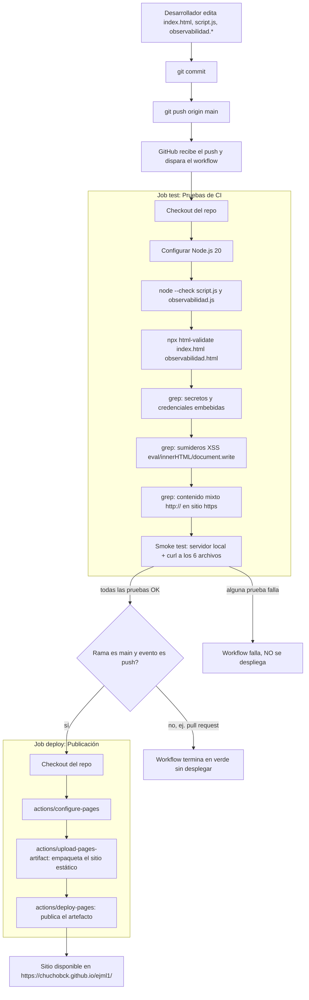

# Flujo de GitHub, GitHub Actions y GitHub Pages (CI/CD)

**Repositorio:** [chuchobck/ejml1](https://github.com/chuchobck/ejml1)
**Rama:** `main`
**Sitio publicado:** https://chuchobck.github.io/ejml1/
**Workflow:** [`.github/workflows/ci-deploy.yml`](.github/workflows/ci-deploy.yml)
**Configuración de validación HTML:** [`.htmlvalidate.json`](.htmlvalidate.json)
**Primer run exitoso de referencia:** https://github.com/chuchobck/ejml1/actions/runs/34371670826

---

## 1. Esquema general del flujo

---

## 2. ¿Qué dispara el workflow?

Definido en el bloque `on:` de `ci-deploy.yml`:

| Evento | ¿Corre el job `test`? | ¿Corre el job `deploy`? |
| :-- | :--: | :--: |
| `push` a `main` | ✅ Sí | ✅ Sí (solo si `test` pasa) |
| `pull_request` hacia `main` | ✅ Sí | ❌ No (valida el PR sin publicar) |
| `workflow_dispatch` (disparo manual desde la pestaña Actions) | ✅ Sí | ✅ Sí, si se ejecuta sobre `main` vía push |

Esto significa que cualquier Pull Request corre las mismas pruebas automáticamente antes de poder mezclarse, pero **solo un push directo a `main`** dispara el despliegue real a producción.

---

## 3. Job `test` — qué hace explícitamente y por qué

Este job corre en una máquina limpia de GitHub (`ubuntu-latest`) en cada push/PR. Pasos, en orden:

1. **Checkout del repositorio** (`actions/checkout@v4`): descarga el código del commit exacto que disparó el workflow.
2. **Configurar Node.js 20** (`actions/setup-node@v4`): entorno necesario para correr `node` y `npx`.
3. **Verificar sintaxis de JavaScript** — `node --check script.js` y `node --check observabilidad.js`.
   - *Qué detecta:* errores de sintaxis que romperían la página en el navegador (paréntesis sin cerrar, tokens inválidos, etc.). No ejecuta el código, solo lo parsea.
4. **Validar HTML** — `npx html-validate index.html observabilidad.html`, usando la configuración de `.htmlvalidate.json` (basada en `html-validate:recommended`, con las reglas `void-style` desactivada y `prefer-native-element` en modo aviso, porque son preferencias de estilo, no errores reales — ver `AUDITORIA.md` §6.1 para el detalle de por qué se desactivaron).
   - *Qué detecta:* etiquetas mal cerradas, atributos duplicados, `id` repetidos, `alt` faltante en imágenes, jerarquía de encabezados inválida, roles ARIA mal usados, entre otras reglas de accesibilidad y validez de marcado.
5. **Escanear secretos y credenciales embebidas** — `grep` con patrones de API keys, contraseñas, tokens y claves de AWS.
   - *Qué detecta:* si alguien commitea por error una credencial en texto plano, el pipeline falla y bloquea el despliegue.
6. **Escanear sumideros de XSS** — `grep` buscando `eval(`, `document.write(`, `dangerouslySetInnerHTML`, `new Function(`.
   - *Qué detecta:* patrones de código que suelen habilitar inyección de scripts (Cross-Site Scripting) si se les pasa contenido no confiable.
7. **Verificar que no haya contenido mixto** — `grep "http://"` sobre todo el proyecto.
   - *Qué detecta:* referencias a recursos por `http://` sin cifrar dentro de un sitio servido por `https://`, que los navegadores bloquean o marcan como inseguros.
8. **Smoke test funcional** — levanta un servidor HTTP estático local (`python3 -m http.server`) y hace `curl` a los 6 archivos del sitio (`index.html`, `styles.css`, `script.js`, `observabilidad.html`, `observabilidad.css`, `observabilidad.js`), verificando que todos respondan `200`.
   - *Qué detecta:* rutas rotas, archivos renombrados o borrados por error, referencias cruzadas incorrectas entre HTML/CSS/JS.

Si **cualquiera** de estos 8 pasos falla, el job `test` termina en rojo y el job `deploy` **no se ejecuta** — el workflow entero queda marcado como fallido y el sitio en producción no se toca.

---

## 4. Job `deploy` — qué hace explícitamente

Solo corre si `test` pasó **y** el evento fue un `push` a `main` (condición `if: github.ref == 'refs/heads/main' && github.event_name == 'push'`).

1. **Checkout del repositorio.**
2. **`actions/configure-pages`**: prepara el entorno de GitHub Pages para recibir un despliegue vía Actions (en vez del modo "legacy" que servía directamente desde la rama sin pruebas).
3. **`actions/upload-pages-artifact`**: empaqueta todo el contenido del repo (`path: "."`) como el artefacto que se va a publicar.
4. **`actions/deploy-pages`**: toma ese artefacto y lo publica en la URL de GitHub Pages del repositorio.

El resultado queda expuesto en la variable `steps.deployment.outputs.page_url`, visible en el resumen del run de Actions y en el entorno `github-pages` del repositorio.

---

## 5. Diferencia clave: antes vs. ahora

| | Antes (2026-09-09, primera activación) | Ahora |
| :-- | :-- | :-- |
| **Fuente de Pages** | `build_type: legacy` — GitHub sirve el contenido de `main` directamente, sin pasos intermedios | `build_type: workflow` — el contenido solo se publica si un job de Actions lo empaqueta y despliega |
| **Pruebas antes de publicar** | Ninguna automática (solo las que corrí manualmente en esta sesión) | 8 verificaciones automáticas en cada push/PR (sintaxis, HTML, secretos, XSS, contenido mixto, smoke test) |
| **Validación de Pull Requests** | No aplicaba | Cada PR contra `main` corre el job `test` antes de poder mergear |
| **Trazabilidad** | Sin registro histórico de verificación | Cada push queda con un run de Actions consultable en `https://github.com/chuchobck/ejml1/actions` |

---

## 6. Cómo verificar el estado del pipeline

- **Desde la terminal:** `gh run list --repo chuchobck/ejml1`
- **Desde el navegador:** pestaña *Actions* del repositorio → https://github.com/chuchobck/ejml1/actions
- **Un run específico:** `gh run view <run-id> --repo chuchobck/ejml1`
- **Reintentar manualmente sin nuevo push:** botón *Run workflow* en la pestaña Actions (habilitado por el trigger `workflow_dispatch`).

---

## 7. Relación con `AUDITORIA.md`

Las 8 verificaciones del job `test` son la versión automatizada de las pruebas de seguridad y pruebas básicas descritas manualmente en `AUDITORIA.md` §6 (ejecutadas allí a mano, el 2026-09-09). A partir de este workflow, esas mismas pruebas corren solas en cada cambio futuro, sin depender de que alguien las repita manualmente.
